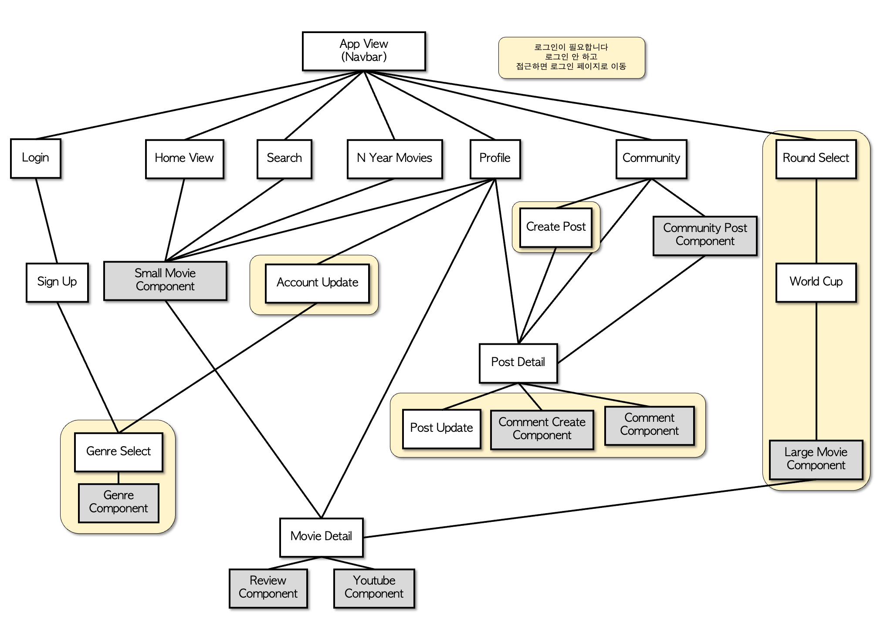

# 🎬 BEfore Film. BEF(베프) Project 💻

> BEF는 개인의 선호 장르에 따라 영화를 추천합니다.
>
> 또한, 여러 소셜 기능을 제공하여 유저에게 재미요소를 더하는 커뮤니티 서비스이기도 합니다.

### 🗓 프로젝트 기간

> __2022. 05. 20. (금) ~ 2022. 05. 26. (목)__

### 🤼 Contributors

---

- 안선혁

- 김지수

### 📚 Stack

---

- __Programming Language__: Python 3.9.9, JavaScript
- __Back-end__ : Django 3.2+
- __Front-end__ : Vue 2

### 🧱 Structure

---

- 전반적인 View 이동 구조와 View 내부 컴포넌트 사용 여부는 다음과 같이 될 예정이다.

### 📊 Modeling

---

- 크게 세 부분으로 나눈다면 User, Movie, Community로 나눌 수 있다.
- 그 외에는 모두 종속적으로 존재하는 부가적인 필드이다.

#### 사용 데이터

- __TMDB 상의 popularity순으로 1만개의 영화 정보__를 사용했고, 사용자가 검색했을 때, DB에 없는 영화라면 DB에 계속 추가되도록 했다.

### 📂 Components

___

화면 구성

### 🛣 URL

---

- 초기 URL은 다음과 같이 설계했다.

## 🛠 개발일지

##### 추천 알고리즘

>  현실적으로, 딥러닝 등을 배우지 않은 상태에서 추천 영화가 매번 바뀌게 하는 방법은 무작위 말고 크게 떠오르는게 없었다. 또한, 데이터에 성별, 나이별 영화 선호도에 대한 정보가 없다. 단순 무작위 방식이 크게 맘에 들지는 않아서, TMDB에서 제공하는 데이터 중 popularity(이하 인기도)와 average_vote(이하 평점)를 이용하는 방법과 사용자가 선호하는 장르 기반의 선택을 활용하고자 했다.

- 여기서 첫 번째 문제는 인기도와 평점의 점수 분포인데, 인기도는 0 ~ 4000의 분포를 가지고 있었고, 평점은 0 ~ 10의 분포를 가지고 있었다(또한, 정규분포도 아니다). 그래서 다음과 같은 방법을 생각했다.

- 각 값들의 분포를 표준화 시키는 특정 인자  를 구하고, 두 분포를 모두 정규분포(와 유사한) 형태로 변형한 뒤, 각 값들을 표준화 시켜 표준화된 __평점과 인기도의 합을 기준__으로, __사용자가 선호하는 장르와 매칭__하고자 했다. 
  - 해당 인자를 요청시마다 정확하게 구하는게 정확성측면에서 크게 유의미 하다고 생각되지 않아 근삿값을 구하고 그 값을 계속 활용하기로 했다
  - 다만 몇몇 이상치를 제외하기 위해 인기도 기준 원래 값이 2 이하인 영화는 제외했다(인기도가 너무 낮은 영화의 평점 투표수가 너무 적어, 평균 평점이 10으로 있는 경우가 다수 있었다).

- 1회 요청시 반환하는 추천 영화 객체는 20개로 정했다. 
  - 선호 장르가 없을 시에는 전체 영화 중 기준에 맞춰 제공한다.
  - 선호 장르가 있다해도, 선호 장르'만' 추천하는건 정보를 너무 편향적으로 제공하게 된다고 생각해, 중간중간 선호장르가 아니더라도 인기가 있는 영화들을 추천하는 방향으로 정했다.
  - 이미 본 영화, 좋아요 혹은 싫어요 표현을 한 영화에 대해서는 추천하지 않도록 한다.
  - 각 유저 인스턴스들은 모두 하나의 덱을 가지고 있는데, 최근에 추천된 영화들을 이 덱에 삽입하여, 추가로 데이터를 요청했을 때, 이 덱에 있는 영화들은 추천하지 않는다. 덱의 최대 길이는 200으로 제한하며, 더 넘게 추천시 덱에서 앞에 있는 영화를 pop하고 새로 추천한 영화를 뒤에서 push한다.

### 0518.

- vue에서 login, logout에 대한 기능을 완성했다.

- 영화 모델링에서 `movie_id`를 `pk`로 대체시키면서 중복되는 영화 93개를 제거하고 모델을 경량화 시켰다.
- 처음에 데이터를 받을 때부터 생각을 하고 받았어야 했는데, 더 문제가 생기기 전에 미리 수정을 진행했다.

- 추천 알고리즘을 수정했다.
  - 표준화는 다음과 같이 진행했다. 장르에 속하는 각 영화의 인기도와 평점에 자연로그와 루트를 씌운 값에서 평균과 표준 편차를 구한 뒤 표준화 시켰다. 이후 표준화된 값을 인기도와 평점기준 7:3의 비율로 반영해 내림차순으로 정렬시켰다.

### 0519. 

##### Home data axios 요청

- 사용자가 접속했을때 가장 처음에 보여지는 화면 HOME에서 보여질 컴포넌트 (현재 상영중인 영화, 작년 이맘때쯤 상영된 영화, 올림픽 우승 영화, 알고리즘추천영화)에 대해 필요한 데이터들을 Django서버로 요청하여 각각의 컴포넌트에 Props하여 데이터를 전달하였다.
  - 영화정보가 담긴 배열을 순회할때 key를 id로 사용했을 경우, 각각의 컴포넌트에서 중복되는 영화가 존재 할 수 있어 key를 for문마다 다르게 사용하였다.

##### Profile axios 요청

- router의 username을 동적세그먼트로 사용하여, userprofile에 접근 할 수 있도록 했다. 서버에 요청을 보낼때는  params에 username을 전달하였다.

-  profile에서 확인 할 수 있는 데이터는

  >  username, name, disliked_movies, liked_genre, wished_to_movies, watched_movies 

  위와같다.

### 0520. 

##### Movie Search 기능 구현

- 검색을 요청할 경우 tmdb axios요청이 보내진다.

- 영화를 검색했을 때 해당 영화가 DB에 저장되어 있지 않은 데이터라면 DB에 추가 되도록 하였다.

##### Movie Detail

- Home , Search 등 영화포스터를 클릭하면  영화 상세정보를 확인 할 수 있다.
- 상세페이지에서 Youtube axios요청을 통해 영화 예고편을 확인 할 수 있다.

