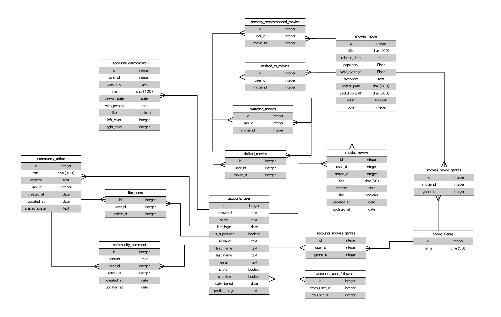

# 🎬 BEfore Film. BEF(베프) Project 💻

> BEF는 개인의 선호 장르에 따라 영화를 추천합니다.
>
> 또한, 여러 소셜 기능을 제공하여 유저에게 재미요소를 더하는 커뮤니티 서비스이기도 합니다.

### 🗓 프로젝트 기간

> __2022. 05. 20. (금) ~ 2022. 05. 26. (목)__

### 🤼 Contributors

---

- 안선혁

- 김지수

### 📚 Stack

---

- __Programming Language__: Python 3.9.9, JavaScript
- __Back-end__ : Django 3.2+
- __Front-end__ : Vue 2

### 🧱 Structure

---

최종적으로 사용된 View 이동 구조와 컴포넌트 사용은 다음과 같다.

### 📊 Modeling

---

- 크게 세 부분으로 나눈다면 User, Movie, Community로 나눌 수 있다.
- 그 외에는 모두 종속적으로 존재하는 부가적인 필드이다.

#### 사용 데이터

- __TMDB 상의 popularity순으로 1만개의 영화 정보__를 사용했고, 사용자가 검색했을 때, DB에 없는 영화라면 DB에 계속 추가되도록 했다.

### 📂 Design Concept

___

- 최종적으로 만들어진 페이지 모습은 다음과 같이 이런 느낌으로 구성 돼 있다.

### 🛣 URL

---

- 최종적으로 사용한 URL은 좀 많아졌다.
- 조금 더 restful하게 줄일 수 있겠지만, 일단은 이번 프로젝트의 목적은 효율이 아닌 완성이기에 추후에 수정하기로 하자.

## 🛠 개발일지

##### 추천 알고리즘

>  현실적으로, 딥러닝 등을 배우지 않은 상태에서 추천 영화가 매번 바뀌게 하는 방법은 무작위 말고 크게 떠오르는게 없었다. 또한, 데이터에 성별, 나이별 영화 선호도에 대한 정보가 없다. 단순 무작위 방식이 크게 맘에 들지는 않아서, TMDB에서 제공하는 데이터 중 popularity(이하 인기도)와 average_vote(이하 평점)를 이용하는 방법과 사용자가 선호하는 장르 기반의 선택을 활용하고자 했다.

- 여기서 첫 번째 문제는 인기도와 평점의 점수 분포인데, 인기도는 0 ~ 4000의 값을 가지고 있었고, 평점은 0 ~ 10의 값을 가지고 있었다(또한, 정규분포도 아니다). 그래서 다음과 같은 방법을 생각했다.

- 각 값들의 분포를 표준화 시키는 특정 인자  를 구하고, 두 분포를 모두 정규분포(와 유사한) 형태로 변형한 뒤, 각 값들을 표준화 시켜 표준화된 __평점과 인기도의 합을 기준__으로, __사용자가 선호하는 장르와 매칭__하고자 했다. 
  - 해당 인자를 요청시마다 정확하게 구하는게 정확성측면에서 크게 유의미 하다고 생각되지 않아 근삿값을 구하고 그 값을 계속 활용하기로 했다
  - 다만 몇몇 이상치를 제외하기 위해 인기도 기준 원래 값이 2 이하인 영화는 제외했다(인기도가 너무 낮은 영화의 평점 투표수가 너무 적어, 평균 평점이 10으로 있는 경우가 다수 있었다).

- 1회 요청시 반환하는 추천 영화 객체는 12개로 정했다. 
  - 선호 장르가 없을 시에는 전체 영화 중 기준에 맞춰 제공한다.
  - 선호 장르가 있다해도, 선호 장르'만' 추천하는건 정보를 너무 편향적으로 제공하게 된다고 생각해, 중간중간 선호장르가 아니더라도 인기가 있는 영화들을 추천하는 방향으로 정했다.
  - 이미 본 영화, 좋아요 혹은 싫어요 표현을 한 영화에 대해서는 추천하지 않도록 한다.
  - 각 유저 인스턴스들은 모두 하나의 덱을 가지고 있는데, 최근에 추천된 영화들을 이 덱에 삽입하여, 추가로 데이터를 요청했을 때, 이 덱에 있는 영화들은 추천하지 않는다. 덱의 최대 길이는 200으로 제한하며, 더 넘게 추천시 덱에서 앞에 있는 영화를 pop하고 새로 추천한 영화를 뒤에서 push한다.

### 0518.

- vue에서 login, logout에 대한 기능을 완성했다.

- 영화 모델링에서 `movie_id`를 `pk`로 대체시키면서 중복되는 영화 93개를 제거하고 모델을 경량화 시켰다.
- 처음에 데이터를 받을 때부터 생각을 하고 받았어야 했는데, 더 문제가 생기기 전에 미리 수정을 진행했다.

- 추천 알고리즘을 수정했다.
  - 표준화는 다음과 같이 진행했다. 장르에 속하는 각 영화의 인기도와 평점에 자연로그와 루트를 씌운 값에서 평균과 표준 편차를 구한 뒤 표준화 시켰다. 이후 표준화된 값을 인기도와 평점기준 7:3의 비율로 반영해 내림차순으로 정렬시켰다.

### 0519. 

##### Home data axios 요청

- 사용자가 접속했을때 가장 처음에 보여지는 화면 HOME에서 보여질 컴포넌트 (현재 상영중인 영화, 작년 이맘때쯤 상영된 영화, 올림픽 우승 영화, 알고리즘추천영화)에 대해 필요한 데이터들을 Django서버로 요청하여 각각의 컴포넌트에 Props하여 데이터를 전달하였다.
  - 영화정보가 담긴 배열을 순회할때 key를 id로 사용했을 경우, 각각의 컴포넌트에서 중복되는 영화가 존재 할 수 있어 key를 for문마다 다르게 사용하였다.

##### Profile axios 요청

- router의 username을 동적세그먼트로 사용하여, userprofile에 접근 할 수 있도록 했다. 서버에 요청을 보낼때는  params에 username을 전달하였다.

-  profile에서 확인 할 수 있는 데이터는

  >  username, name, disliked_movies, liked_genre, wished_to_movies, watched_movies 

  위와같다.

### 0520. 

##### Movie Search 기능 구현

- 검색을 요청할 경우 tmdb axios요청이 보내진다.

- 영화를 검색했을 때 해당 영화가 DB에 저장되어 있지 않은 데이터라면 DB에 추가 되도록 하였다.

##### Movie Detail

- Home , Search 등 영화포스터를 클릭하면  영화 상세정보를 확인 할 수 있다.
- 상세페이지에서 Youtube axios요청을 통해 영화 예고편을 확인 할 수 있다.

##### Community

- 기본적인 커뮤니티 기능을 추가했다.
  - 게시글 작성, 수정, 삭제
  - 댓글 작성, 수정, 삭제

### 0521.

##### 영화 월드컵

- 영화 월드컵 기능을 추가했다.
  - 유저가 본 영화와 인기순 영화 중 유저가 선택한 라운드(32, 64, 128, 256강)에 맞춰 영화를 랜덤으로 선택한다.
  - 서버에서는 선택한 영화와 토너먼트 순서를 JSON 데이터로 보내준다.
  - 기본적으로 완전이진트리의 토너먼트 형태를 가져가나, 평범한 완전이진트리의 토너먼트 형태를 할 시 현재 선택하는 영화와 바로 다음에 선택한 영화가 다음 라운드에 매치된다는게 명확해진다. 이런 부분 때문에 조금의 재미를 더하기위해 라운드마다 셔플하는 과정을 거쳐 다음 라운드를 예측하지 못하게 만들었다.

### 0522.

- 회원가입 시 닉네임을 입력하게 만들었다.
  - 닉네임은 중복 불가능하다.
  - drf auth에서 제공하는 회원가입 폼이 기본적으로 username, password1, password2만 입력받기 때문에 일반적으로 이를 상속받아서 추가로 입력받게 만들어야하나, 이번 프로젝트는 효율보다는 그 때 그 때 생각나는 방법으로 만들었다.
  - 그래서 생각한 방법은 그냥 '여러번 axios 요청을 보내 확인하자'이다. 먼저, 닉네임이 존재하는지 확인하는 axios 요청을 보낸후 없다는 응답이 오면, drf auth를 통해 회원가입을 진행한다. 이후 그 계정에 닉네임을 정하는 axios 요청을 한 번 더 보내고 이 요청에서 최종적으로 유저 정보를 받아온다.

- Home에서 기본적으로 상영중영화, 현재 월 상영영화, 올림픽 우승 영화, 추천 영화 등을 보여주게 만들었다.
  - 여기서 각 영화카드 뒷면에는 카드에 대한 감정표시 및 이미 본 영화를 체크할 수 있는 버튼을 만들었는데 회원 정보를 활용해 이미 누른 버튼인지 확인하는 과정이 필요했다.
  - 이 과정에서 유저의 상세한 정보가 필요했는데, 기존의 current user 정보는 이 정보들을 담고있지 않았다. 그래서 로그인시 current user가 상세한 정보를 받아오도록 vue와 django를 수정하는 과정을 거쳤다. 

- 유저간 팔로우  기능을 추가했다.

### 0523.

##### 프로필 이미지 추가

- 프로필 이미지를 넣을 수 있게 추가했다.
  - user model에 프로필 이미지를 text형태로 넣을 수 있게 필드를 추가했다.
  - image파일 자체를 json데이터로 넘기는 방법은 생각나지 않아 일단 base64 인코딩 과정을 거쳐 text의 형태로 보내고 그 자체로 저장하게 만들었다.
  - 저장 방식은 닉네임이 저장될 때 같이 저장되도록 만들었다.

###### 보완점

- base64 인코딩과정이 그렇게 효율적이지 않은데다가 엄청나게 긴 텍스트가 저장되다보니 부담이 될 수 있다.
  - 이를 위해 front에 이미지 파일을 저장하고 그 이미지 경로만 데이터베이스에 저장하자 라는 생각이 들었다.
  - 다만, 코딩 방식은 좀 찾아봐야할 거 같다. + 파일명 중복시 처리 방법에 대해서도 생각해봐야한다.

##### 프로필 페이지 제작

- 프로필 페이지를 만들었다.

  - 본인이 들어갔을 때는 회원 정보 수정이 간편하게, 타인이 들어갔을 때는 팔로우 버튼이 생기게 만들었다.

  - 프로필 유저가 좋아하는 영화, 이미 본 영화, 작성한 게시글 등을 확인할 수 있다.

###### 생각해볼 점

- 팔로우 기능이 있어도 팔로우하는 사람들의 글만 필터링하거나 팔로우하는 사람의 계정으로 쉽게 이동하는 방법이 없다. 이래서야 팔로우 버튼의 의미가 없다.

### 0524.

##### 장르선택

- 장르선택 창 구체화
  - 회원가입시 자동으로 장르선택 창으로 넘어가며 선호하는 장르를 고르고 다음으로 넘어갈 수 있게 만들었다. 본인 프로필 페이지에서도 선택할 수 있다. 매 선택마다 axios 요청을 통해 유저 정보를 갱신한다.
  - 여기서 선택한 장르가 추천영화의 기본 베이스가 된다.

##### 프로필 이미지 변경

- 프로필 이미지 변경을 구현했다.
  - 유저가 이미지를 넣은 후 맘에 들지 않을 시 원래대로 돌릴 수 있도록 했다.
  - 유저의 프로필 이미지와 변경 중인 이미지가 다를 경우에만 되돌리기와 확인 버튼이 보이도록 만들었다.
  - 중간에 tmp를 사용해 현재 프로필 이미지와 다른지를 확인하도록 했다.

##### 공유하기

- 월드컵에서 우승한 영화를 커뮤니티에 공유할 수 있게 만들었다.
  - 이를 위해 커뮤니티 모델에 약간의 수정을 했다.
  - 공유할 때 영화의 포스터를 같이 공유할 수 있도록 shared poster field를 추가했고, 이 값이 공란일 시 공유되지 않은 글, 이 값이 있을 시 공유 된 글로 처리하도록 했다.
  - 공유하기 버튼을 누르면 자동으로 제목 앞에 영화제목과 해시태그가 추가되며 글의 내용에 영화 포스터가 추가된다.

##### 비밀번호 변경

- 비밀번호 변경 폼을 추가했다.
  - drf auth 기본 제공 비밀번호 변경폼에서 old_password를 추가로 입력해서 현재 비밀번호를 입력해야 비밀번호를 재설정할 수 있도록 만들었다.

### 0525.

##### 카카오톡 공유하기

- 카카오톡 api를 이용해서 월드컵에서 우승한 영화를 카카오톡으로 공유할 수 있게 만들었다.

##### 회원탈퇴

- 회원탈퇴 기능을 만들었다.
  - 회원 탈퇴 버튼을 누르면 확인/취소 선택을 할 수 있고, 최종적으로 '회원탈퇴' 라는 문구를 입력받아 일치한다면 회원탈퇴가 진행되도록 만들었다.

##### 포토카드 기능 추가

- 포토카드를 만들 수 있는 기능을 추가했다.
  - 사진을 삽입하고 왼쪽 오른쪽 카드의 빛 색상을 결정할 수 있다.
  - code pen에서 기본적인 틀을 가져오고 html 기본 구조와 css를 수정해 사용했다.
  - 색상 버튼을 만들어 유저가 그 색상을 누르면 카드의 빛 색깔의 css 속성을 변화시켜 빛 색상을 바뀌게 만들었다.
  - 유저는 카드 내에 필요한 정보를 넣을 수 있다.
  - 만든 카드는 유저의 프로필에서 볼 수 있으며, 카카오톡을 통해 프로필 페이지를 공유할 수 있다.

### 0526. 

##### 리뷰 삭제

- 디테일에서 본인이 남긴 리뷰를 삭제할 수 있게 만들었다.
  - 디테일 페이지의 리뷰는 간단히 한줄 리뷰를 위해 만들어둬서 따로 수정버튼을 만들지는 않았다.

##### sweatAlert

- sweatAlert 를 추가해 모든 alert, confirm, prompt를 sweatAlert로 변경했다.

##### 404 page

- 존재하지 않는 경로로 이동시 자동으로 404 Page not found 페이지로 이동하게 만들었다.

##### login guard

- 로그인이 필요한 페이지와 필요하지 않은 페이지를 구분해 로그인하지 않은 상태에서 로그인이 필요한 페이지로 이동시 자동으로 로그인 페이지로 이동하도록 만들었다.

##### Community 수정

- 커뮤니티 메인 페이지에서 가장 많은 좋아요를 받은 유저, 가장 게시물을 많이 작성한 유저들을 목록으로 보여주게 만들었다.
- 일간 박스오피스 상위 5개 영화가 페이지 좌하단에 나오도록 만들었다.
- 화면 최상단에 박스오피스 상위 3개영화의 예고 영상이 랜덤으로 나오도록 만들었다.

#### 최종.

- 최종적으로 잔잔한 버그들을 픽스했다.

- 추천 알고리즘 중 덱을 사용하는 과정에서 유저의 최근 추천 영화를 불러올 때, 영화의 id순으로 불러와지는 걸 발견했다. 이를 추천순으로 불러와지도록 수정했다.
